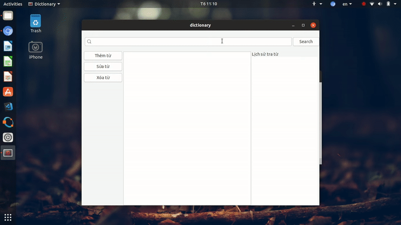

# English - Vietnamese Dictionary

## Description

A small project that we had done in the mid-term semester 20172 at [HUST](https://www.hust.edu.vn/).

We learnt some advanced data structures implemented in C Programming Language such as [Red-Black Tree](http://www.cs.utk.edu/~plank/plank/classes/cs360/360/notes/JRB/),
[B-tree](http://www.hydrus.org.uk/doc/bt/html/ch05.htm),
[Directed and Undirected Graph](https://www.geeksforgeeks.org/graph-data-structure-and-algorithms/).
We also studied lots of corresponding algorithms to manipulate with them such as [DFS](https://www.geeksforgeeks.org/depth-first-search-or-dfs-for-a-graph/),
[BFS](https://www.geeksforgeeks.org/breadth-first-search-or-bfs-for-a-graph/), etc. We learnt how to use availble libraries efficiently and build our own ones, too.

This dictionary is created based on the [B-tree](http://www.hydrus.org.uk/doc/bt/html/ch05.htm) data structure, and its GUI is designed using [Glade](https://glade.gnome.org/) in [Ubuntu](https://www.ubuntu.com/) environment.

## Team
- [Do Duc Hoang](https://github.com/vinhyenvodoi98)
- [Nguyen Dich Long](https://github.com/DrNguyen2525)

## Operating System
- [Linux Ubuntu](https://www.ubuntu.com/)

## Data Structure
- [B-tree](http://www.hydrus.org.uk/doc/bt/html/ch05.htm)

## GUI
- [Glade](https://glade.gnome.org/)

## Features
- Search
- Modify
- Add
- Delete

## Instruction

1. Download this repository and extract it.
2. Open the command window in your OS and move to `dictionary` folder.
3. Type `make` and enjoy.

**You can also double click on the `dictionary` file directly to excute it** :+1:

